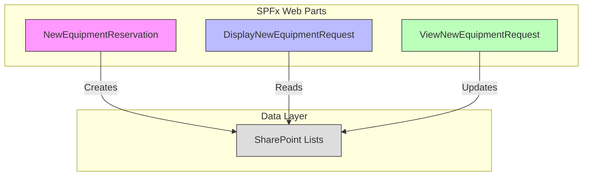
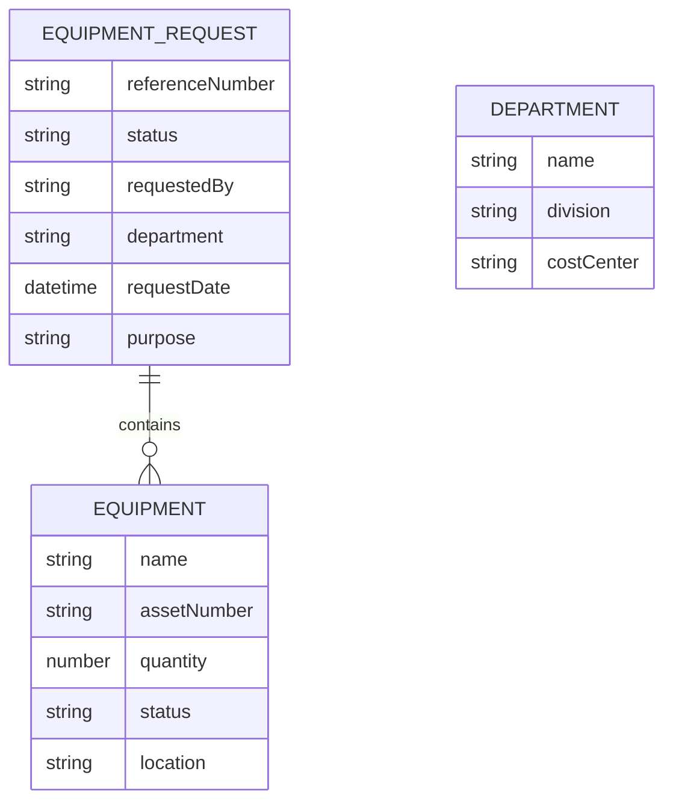
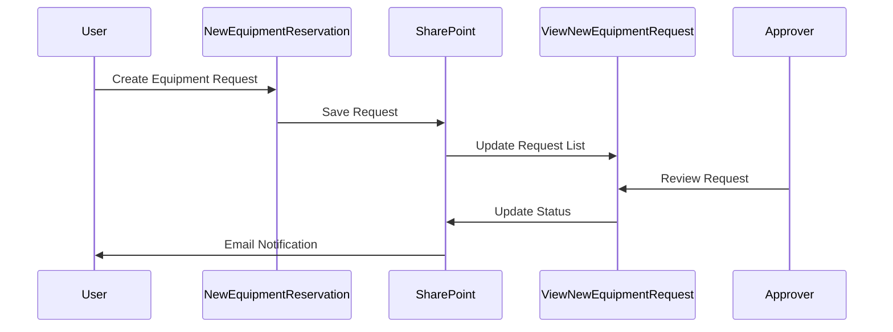
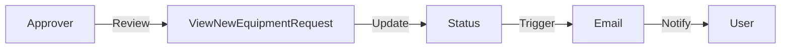

# System Architecture

## Overview

The New Equipment Reservation System is built using the SharePoint Framework (SPFx), designed to provide a streamlined solution for managing equipment reservations within an organization. The system follows a component-based architecture pattern, leveraging React for the user interface and SharePoint lists for data persistence.

## System Decomposition

The system is decomposed into three primary web parts, each serving distinct functionalities within the equipment reservation ecosystem:

**1. New Equipment Reservation (NewEquipmentReservation)**

The New Equipment Reservation component serves as the primary interface for users to create and submit equipment reservation requests. It provides an intuitive form interface through its Equipment Form Handler, allowing users to input reservation details efficiently. The component integrates with SharePoint lists through its Equipment Selection System to present available equipment and their current status. The Equipment Dialog system manages the equipment selection process with comprehensive search and filtering capabilities. Data integrity is maintained through the Validation Service, which validates user inputs against business rules. The SharePoint Integration Service handles all data operations with SharePoint lists, ensuring seamless data persistence and retrieval.

**2. Display Equipment Request (DisplayNewEquipmentRequest)**

The Display component focuses on presenting equipment reservation information in a clear and organized manner. It implements responsive design patterns through its Display Renderer to ensure optimal viewing across different devices and screen sizes. The Equipment Information Display presents key reservation details in a user-friendly format, while the Equipment List Viewer provides a comprehensive view of all equipment included in the reservation. The Status Display component shows the current state of the equipment reservation request, keeping users informed of their request's progress.

**3. View Equipment Request (ViewNewEquipmentRequest)**

This component manages the viewing and processing of equipment requests, particularly focusing on the approval workflow. Through its Request Management Interface, it provides tools for reviewing and processing equipment requests efficiently. The Status Management system tracks the lifecycle of each equipment reservation from submission through approval or rejection. The Filtering System enables users to sort and filter requests based on various criteria such as date, status, or equipment type. Custom Views functionality allows different user roles to see relevant information in their preferred format, enhancing the efficiency of the request management process.

## Data Layer Architecture

The system utilizes SharePoint lists as its primary data store, with the following key structures:

1. **Equipment Request List**: Stores main reservation details
2. **Equipment List**: Manages equipment inventory and status
3. **Department List**: Maintains organizational structure
4. **User Groups**: Manages permissions and approvals

## Component Collaboration

The system components interact through the following patterns:

1. **Request Flow**:
   - NewEquipmentReservation creates new requests
   - SharePoint Service validates and stores data
   - ViewNewEquipmentRequest enables approver actions
   - DisplayNewEquipmentRequest shows current status

2. **Approval Workflow**:
   - Automated status tracking (Pending → Approved/Rejected)
   - Role-based access control
   - Email notifications at key stages

## Design Patterns Used

1. **Component Pattern**: Implemented throughout React components (EquipmentDialog, EquipmentList, etc.)
2. **Service Pattern**: Used in SharePointService for data access abstraction
3. **State Management**: Utilizing React state and interfaces (INewEquipmentReservationState)
4. **Factory Pattern**: For creating standardized form elements (FormComponents)
5. **Observer Pattern**: For handling real-time updates and notifications

## Rationale for System Decomposition

The system was decomposed into these specific components for several reasons:

1. **Separation of Concerns**: Each web part handles a distinct aspect of the equipment reservation system
2. **Maintainability**: Modular design with shared components (common folder structure)
3. **Scalability**: Components can be enhanced independently
4. **Reusability**: Common components (EquipmentList, ModalPopup, etc.) are shared
5. **Security**: Role-based access control implementation

## System Behavior

### Key Workflows:

1. **Equipment Request Creation**:

2. **Approval Process**:

## Integration Points

1. **SharePoint Integration**:
   - Lists for data storage (Equipment, Requests)
   - User groups for permission management
   - SharePoint REST API for data operations

2. **Email System Integration**:
   - Automated notifications
   - Status updates
   - Request confirmations

## Technical Considerations

1. **Performance**:
   - Optimized SharePoint queries in SharePointService
   - Efficient state management using interfaces
   - Component-level validation

2. **Security**:
   - Role-based access control
   - Input validation using validation.ts
   - Data sanitization

3. **Scalability**:
   - Modular architecture with shared components
   - Reusable utility functions (helpers.ts)
   - Extensible interfaces

This architecture provides a robust foundation for the equipment reservation system while maintaining flexibility for future enhancements. The component-based approach ensures that new features can be added with minimal impact on existing functionality.
